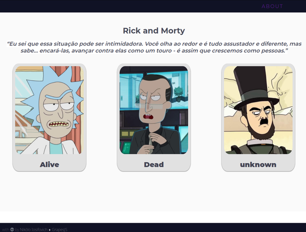

<h1 align='center'>Rick & Morty</h1>

  

  
  
  
   

> 
"Eu sei que essa situação pode ser intimidadora. Você olha ao redor e é tudo assustador e diferente, mas sabe… encará-las, avançar contra elas como um touro - é assim que crescemos como pessoas."

Aplicação desenvolvida com a finalidade de colocar em prática meus estudos em NodeJS. A aplicação consiste na aquisição de informações das personagens da série Rick and Morty a partir da api oficial [RickAndMorty API](https://rickandmortyapi.com/api/character/) e categorizá-las por status (_alive_, _dead_, _unkown_).

<h3>Tecnologias utilizadas:</h3>

- [x] nodejs
- [x] express
- [x] nunjucks
- [x] axios
- [x] nodemon (apenas em modo de desenvolvimento)
- [x] npm
- [x] html, css e javascript

<h3>Como rodar:</h3>

Primeiro devemos clonar o repositório para o uma pasta local:

`git clone https://github.com/nikoloiosifovich/rickAndMorty.git`

em seguida, acessar a pasta clonada e instalar as dependências:

`cd rickAndMorty`

`npm install`

por fim, para rodar a aplicação em modo desenvolvedor:

`npm run dev`

e em modo produção:

`npm start`

<em>Nota: Esta aplicação roda em <strong>http://localhost:3333</strong> e testes não foram implementados, pois ainda estou estudando sobre.</em> <strong>That's all folks!</strong>

